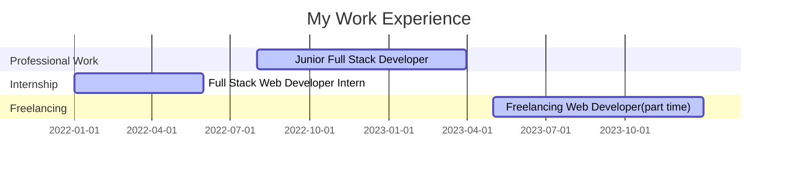

### About Me 

Hey there! I'm a Full Stack Developer with a passion for software development and tech. I have a solid foundation in software development and a proven track record of delivering high-quality projects.

## Tools I Use

- **OS**: Linux (Arch Linux, by the way)
- **Window Manager**: [Hyprland](https://hyprland.org/)
- **Text Editor**: nvim (slightly customized with [Lazyvim](https://www.lazyvim.org/) or [Lunarvim](https://www.lunarvim.org/))
- **Keyboard Layout**: [Miryoku](https://github.com/manna-harbour/miryoku)

## Experience:

## Skills:

I am proficient in a diverse range of technologies, including JavaScript, Node.js, TypeScript, HTML, CSS, React, JSX, SCSS, Tailwind, SQL, MongoDB, Git, and Linux. This broad skill set allows me to excel in both front-end and back-end development. I am adept at developing robust and scalable applications that meet the highest standards of quality and performance.

## Let's Connect!

If you are looking for a part-time/contract Full Stack Developer, I would be thrilled to connect with you. Whether you have a project in mind, want to collaborate, or have any other opportunities to discuss, please feel free to reach out to me.

You can connect with me on [LinkedIn](https://www.linkedin.com/in/ultrahalf/) to explore potential collaborations. Additionally, you can hire me directly through [Upwork](https://www.upwork.com/freelancers/~019b90de03b64060eb) for freelance projects. 

Feel free to reach out to me via email at muhammadalthafrahman@gmail.com. 

Let's connect, share ideas, and explore new opportunities together. I'm excited to hear from you!

Thank you for visiting my GitHub profile, and I look forward to connecting with fellow professionals!

### Stats

<!---->

