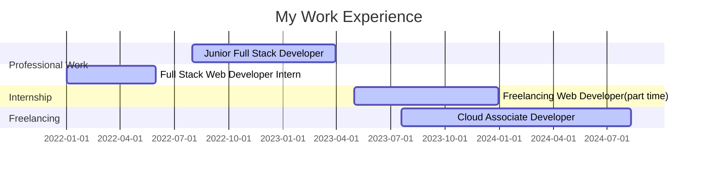

### About Me 

Hey there! I'm a Full Stack Developer.

## Tools I Use

- **OS**: Linux 
- **Window Manager**: [Hyprland](https://hyprland.org/)
- **Text Editor**: nvim 
- **Keyboard Layout**: [Miryoku](https://github.com/manna-harbour/miryoku) 

## Experience:

### Stats

<!---->

